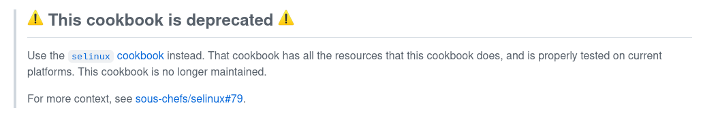

---
header-includes:
  - \usepackage{helvet}
  - \renewcommand{\familydefault}{\sfdefault}
  - \usepackage{fancyhdr}
  - \pagestyle{fancy}
  - \rhead{Robert Detjens - detjensr}
  - \renewcommand{\headrulewidth}{0pt}
colorlinks: true
---

# Technical Contribution Report

## Project Information

### URL

<https://github.com/sous-chefs>, specifically
<https://github.com/sous-chefs/selinux_policy>

### License

Apache 2

### Description


The [Sous Chefs cookbooks](https://github.com/sous-chefs) are a large family of
over 180 open-source cookbooks for the [Chef configuration
management](https://github.com/chef/chef) tool, and are heavily used by the Chef
community. These cookbooks are libraries written in Ruby and use Chef resources
to configure particular aspects of the system.

These cookbooks are aimed at sysadmins using Chef to manage their fleet of
machines. Chef provides a large number of basic tools as part of itself for
installing packages, creating files, etc; however there are very few
service-specific interactions. The Sous Chefs cookbooks provide these resources
via community-maintained cookbooks, which provide resources for e.g. configuring
an NGINX site, installing MySQL, and so forth.

## Contribution

For my final contribution, I improved documentation on a Sous Chefs cookbook.

The particular problem I've identified is that the [`selinux_policy`
cookbook](https://github.com/sous-chefs/selinux_policy)'s resources were
silently deprecated in [a PR to the `selinux`
cookbook](https://github.com/sous-chefs/selinux/pulls/79). This change was not
documented on the `selinux_policy` side at all. I will be contributing updated
documentation to this cookbook explaining this deprecation and how to migrate to
the improved resources in`selinux`.

The PR with this change is available as [sous-chefs/selinux_policy#154](https://github.com/sous-chefs/selinux_policy/pull/154) with the updated section
of the README included below. My original PR linked in this notice includes
documentation on how to migrade over.

```md
> ## This cookbook is deprecated
>
> Use the [`selinux` cookbook](https://github.com/sous-chefs/selinux) instead.
> That cookbook has all the resources that this cookbook does, and is properly
> tested on current platforms. This cookbook is no longer maintained.
>
> For more context, see
> [sous-chefs/selinux#79](https://github.com/sous-chefs/selinux/pull/79).
```


