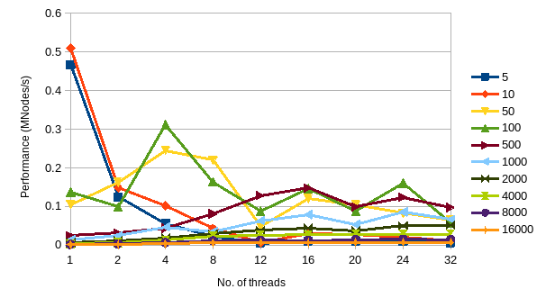

---
header-includes:
  - \usepackage{pgfplots}

title: 'CS 475 Project 2: Numeric Integration'
author:
  - Robert Detjens
  - detjensr@oregonstate.edu
---

## Runtime information

This benchmark was done on an 8-core Intel i7-1165G7 running Fedora Linux.

## Volume

As the number of nodes increases, the volume approaches 7.757854.

## Graphs

\newcommand{\threads}{1,2,4,8,12,16,20,24,32}
\newcommand{\nodes}{50,100,500,1000,2000,4000,8000}
<!-- \newcommand{\nodes}{1000,2000,4000,8000,16000} -->

\pgfplotsset{
  axis lines = left,
  grid = major,
  grid style = {dashed,gray!30},
  legend pos = outer north east,
  legend cell align = left,
  cycle list name = color list,
}

\begin{figure}[h]
  \centering
  \begin{tikzpicture}
    \begin{semilogxaxis}[
      xlabel = {No. of Integration Slices},
      ylabel = {Performance (MNode/s)},
      xtick  = {\nodes},
      scaled ticks = false,
    ]
      \foreach \N in {\threads} {
        \addplot table[col sep=comma,x=nodes,y=\N]{results-nodes.csv};
        \addlegendentryexpanded{\N \ threads}
      }
    \end{semilogxaxis}
  \end{tikzpicture}
  \caption{Integration Slices vs Performance across different numbers of threads}
\end{figure}

\begin{figure}[h]
  \centering
  \begin{tikzpicture}
    \begin{axis}[
      xlabel = {Threads used},
      ylabel = {Performance (MNode/s)},
      xtick  = {\threads},
    ]
      \foreach \N in {\nodes} {
        \addplot table[col sep=comma,x=threads,y=\N]{results-threads.csv};
        \addlegendentryexpanded{\N \ nodes}
      }
    \end{axis}
  \end{tikzpicture}
  \caption{Threads vs Performance across different numbers of slices}
\end{figure}

## Pivoted graphs

<!-- { width=60% } -->

<!-- { width=60% } -->

Performance peaks at

- What patterns are you seeing in the speeds?

- Why do you think it is behaving this way?

- What is the Parallel Fraction for this application, using the Inverse Amdahl equation?

- Given that Parallel Fraction, what is the maximum speed-up you could ever get?
